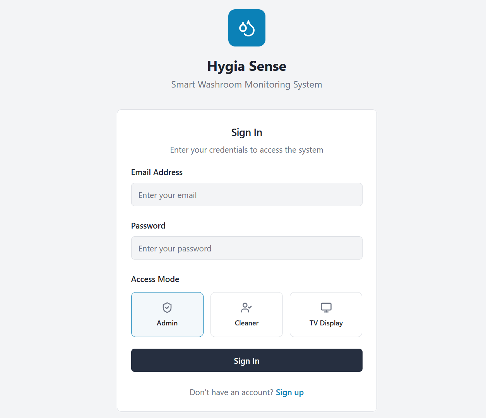
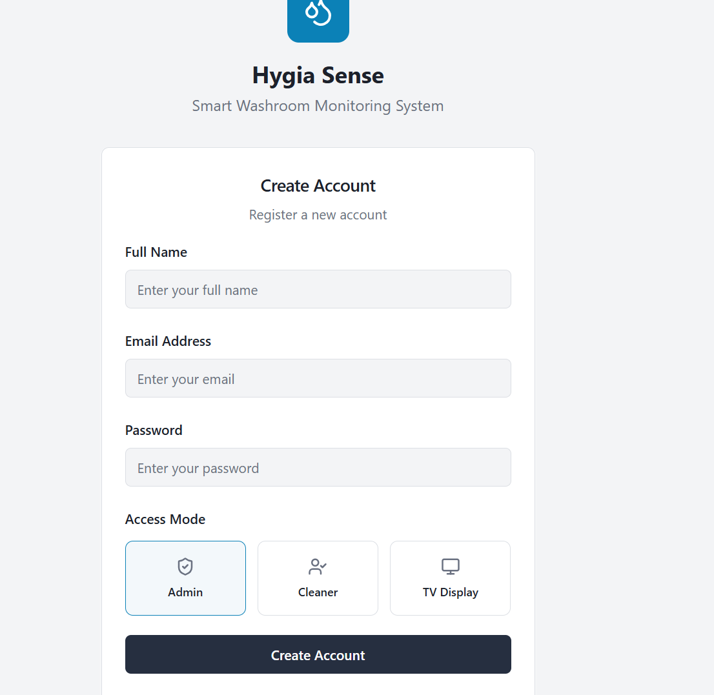
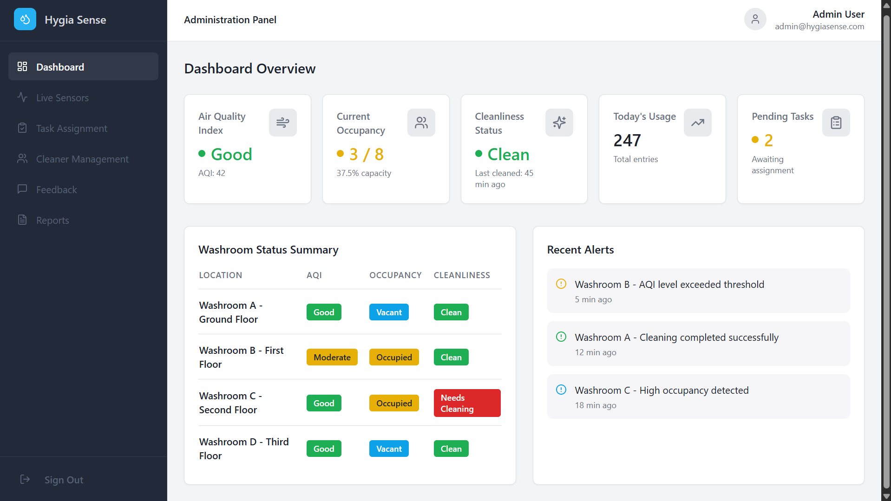
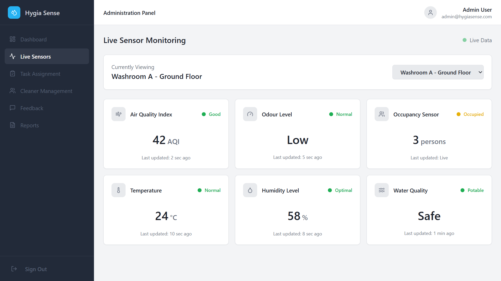
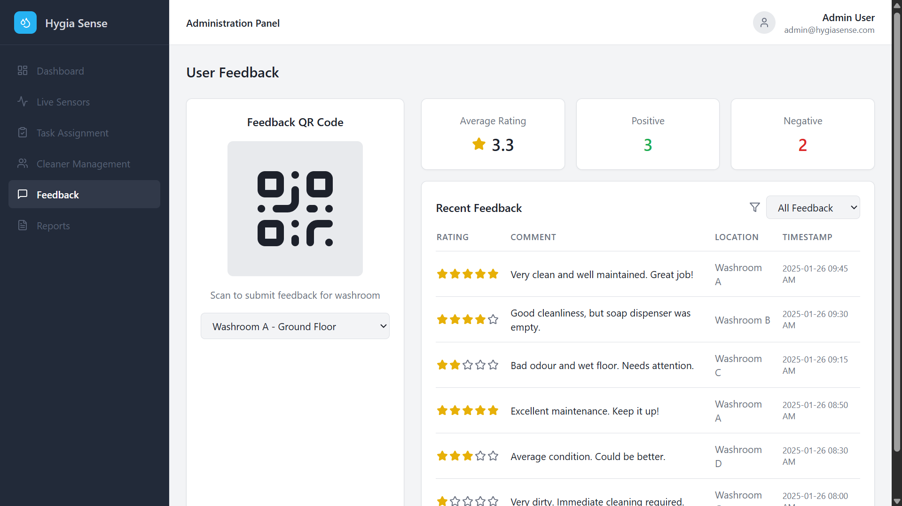
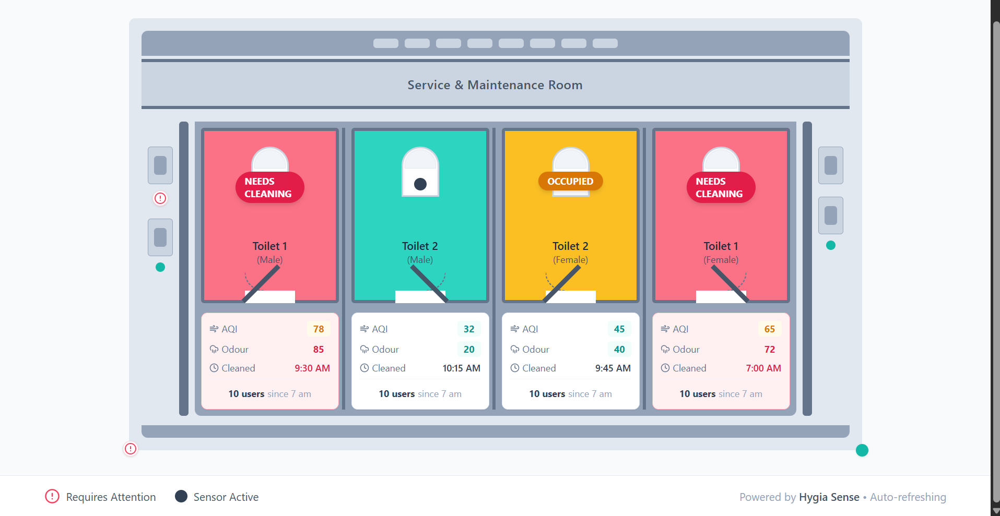

# Hygia Sense

### Smart Washroom Monitoring System

---

## 📌 Overview

Hygia Sense is a **Smart Washroom Monitoring System** designed to improve hygiene, transparency, and accountability in public toilets across India.

In most public washrooms, users enter blindly without knowing:

- Which toilet is clean
- Which toilet is occupied
- When it was last cleaned

This often leads to **poor hygiene experiences**, health risks, and serious issues for **women**, who are more vulnerable to infections caused by unhygienic public toilets.

Hygia Sense solves this problem using **real-time monitoring, digital task management, and user feedback**.

---

## ❗ Problem Statement

Public toilets in India face the following daily challenges:

- No real-time information about toilet cleanliness
- Users unknowingly enter dirty toilets
- No system to monitor cleaner performance
- No accountability for cleaning tasks
- No structured way for users to give feedback
- Authorities lack data to improve sanitation

Due to these issues:

- Hygiene conditions degrade quickly
- Women face higher chances of infections
- Maintenance becomes reactive instead of preventive

---

## 🎯 Motivation

We identified that:

- Cleaning happens without verification
- Complaints are handled only after problems occur
- There is no transparency for users
- There is no digital record of cleanliness

Our goal was to **digitize public washroom management** and provide:

- Transparency to users
- Accountability to cleaners
- Actionable data to authorities

---

## ✅ Solution

Hygia Sense provides a **complete digital solution** by:

- Showing real-time cleanliness and occupancy status
- Monitoring washrooms using sensors
- Assigning and tracking cleaning tasks digitally
- Measuring cleaner efficiency
- Collecting user feedback through QR codes
- Displaying toilet availability on TV screens

---

## 🚀 Key Features

### 🚻 Toilet Status Monitoring

- Clean / Needs Cleaning
- Occupied / Vacant
- Last cleaned time
- Usage count

### 📡 Live Sensor Monitoring

- Air Quality Index (AQI)
- Odour level
- Temperature
- Humidity
- Water quality

### 🧑‍💼 Admin Dashboard

- Centralized control panel
- Live monitoring of all washrooms
- Alerts and reports
- Task assignment to cleaners

### 👷 Cleaner Work Monitoring

- Digital task assignment
- Task status tracking
- Performance and efficiency calculation
- Shift-based monitoring

### 💬 User Feedback (QR Based)

- QR code placed inside washrooms
- Users can rate cleanliness
- Users can report issues instantly

### 📺 TV Display System

- Public TV screens show toilet availability
- Helps users quickly find clean toilets
- Reduces overcrowding and confusion

---

## 🛠️ Technologies Used

### Frontend

- React
- TypeScript
- Vite
- Tailwind CSS
- shadcn/ui
- React Router
- React Hook Form
- Zod
- TanStack React Query
- Recharts

### Backend

- Node.js
- Express.js
- MongoDB
- Mongoose
- dotenv
- CORS

---

## ▶️ How to Run the Project

### Prerequisites

- Node.js installed
- MongoDB running (local or cloud)
- Git installed

### Backend Setup

```bash
cd backend
npm install
npm run dev
```

Backend runs on: http://localhost:5000

### Frontend Setup

```bash
cd frontend
npm install
npm run dev
```

Frontend runs on: http://localhost:5173

---

## 📸 Screenshots

### Authentication




### Admin Dashboard



### Live Sensor Monitoring



### Task Assignment


### Cleaner Management


### Cleaner Efficiency


### Cleaner Portal


### User Feedback



### Toilet Data Overview



### TV Display Screen


---

## 🌍 Impact

- Improves hygiene in public washrooms
- Reduces health risks, especially for women
- Ensures cleaner accountability
- Provides transparency to users
- Enables data-driven sanitation management

---

## 👥 Contributors

- **Ujjawal Verma**
- **Srashti Shukla**

---

## 🏁 Conclusion

Hygia Sense transforms traditional public toilets into **smart, monitored, and hygienic facilities** by combining real-time monitoring, cleaner performance tracking, and user feedback — making public sanitation safer, smarter, and more reliable.
